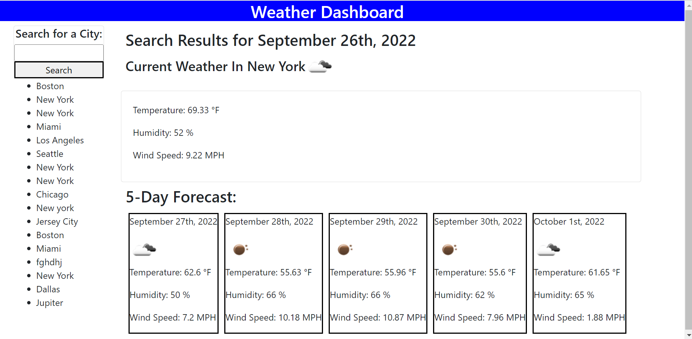

# weather-dashboard

---

The goal of this assignment was to create a weather dashboard web application, utilize an API key to fetch and retrieve weather data from the Open Weather server-side API, and display both the current and future weather conditions for a city the user searched for on the page. Click to access my weather dashboard web application [here](https://caitoreilly.github.io/weather-dashboard/).

## Description

---

This weather dashboard is an interactive web application that allows users to search for a city name in a search bar. After the user types a city name in and clicks the "search" button, a fetch request is called to the Open Weather API to find the current weather of that location. The current weather is then displayed on the web page including the city's name, a weather icon to match the current weather conditions, the temperature, humidity percentage, and wind speed. Moment.js is utilized to display the current date at the top of the web page as well. In addition to the current weather being fetched, the forecast data is also fetched through a second call and function. This five-day forecast data is then displayed in five cards underneath the current weather. Very similary to the top of the page, the date, weather icon, temperature, humidity percentage, and wind speed is included for each day in the forecast. Moment.js was used again to format the dates in these cards. When the search button is clicked, the city name entered by the user is saved to local storage and then displayed in the search history box on the left side of the page under the search bar. Users can click on any of these city names, and the current weather and five day forecast weather will be displayed on the web page.

### Technologies

---

This project was created with:

- HTML
- CSS
- JavaScript
- Bootstrap
- Moment.js
- Open Weather API

#### Screenshot

---

This image displays the Weather Dashboard web application after a user searched a city name.

